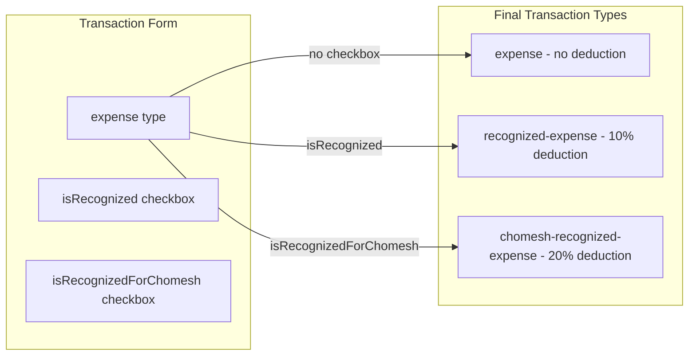

# Add Chomesh Recognized Expense Feature

## Overview

Add a new checkbox "Recognized Expense for Chomesh" (`isRecognizedForChomesh`) for expense transactions that creates a `chomesh-recognized-expense` type. This type deducts **20%** of the expense from the tithe balance (vs 10% for regular `recognized-expense`).

The two checkboxes (`isRecognized` and `isRecognizedForChomesh`) are **mutually exclusive** - only one can be selected at a time.

## Architecture



---

## Part 1: TypeScript Type Definitions

### 1.1 [src/types/transaction.ts](src/types/transaction.ts)

Add `chomesh-recognized-expense` to both the type and array:

```typescript
export type TransactionType =
  | "income"
  | "expense"
  | "donation"
  | "exempt-income"
  | "recognized-expense"
  | "chomesh-recognized-expense" // NEW
  | "non_tithe_donation"
  | "initial_balance";

export const transactionTypes = [
  // ... existing types
  "chomesh-recognized-expense", // NEW
] as const;
```

### 1.2 [src/types/transactionLabels.ts](src/types/transactionLabels.ts)

Add label and badge color:

```typescript
export const transactionTypeLabels: Record<TransactionType, string> = {
  // ... existing
  "chomesh-recognized-expense": "הוצאה מוכרת לחומש", // NEW
};

export const typeBadgeColors: Record<TransactionType, string> = {
  // ... existing
  "chomesh-recognized-expense":
    "bg-purple-100 text-purple-800 border-purple-300", // NEW (purple to distinguish from rose)
};
```

---

## Part 2: Schema and Form Service

### 2.1 [src/lib/schemas.ts](src/lib/schemas.ts)

Add new checkbox field to schema (around line 139):

```typescript
isRecognized: z.boolean().default(false),
isRecognizedForChomesh: z.boolean().default(false),  // NEW
isFromPersonalFunds: z.boolean().default(false),
```

Add validation refinement (mutual exclusion):

```typescript
.refine(
  (data) => {
    // Cannot have both recognized expense types
    if (data.isRecognized && data.isRecognizedForChomesh) {
      return false;
    }
    return true;
  },
  {
    message: t("transactions:transactionForm.validation.recognizedExpense.mutuallyExclusive"),
    path: ["isRecognizedForChomesh"],
  }
)
```

### 2.2 [src/lib/data-layer/transactionForm.service.ts](src/lib/data-layer/transactionForm.service.ts)

Update `normalizeToBaseType`:

```typescript
export function normalizeToBaseType(type: TransactionType): TransactionType {
  if (type === "exempt-income") return "income";
  if (type === "recognized-expense") return "expense";
  if (type === "chomesh-recognized-expense") return "expense"; // NEW
  if (type === "non_tithe_donation") return "donation";
  return type;
}
```

Update `determineFinalType`:

```typescript
export function determineFinalType(
  values: TransactionFormValues,
): TransactionType {
  const {
    type,
    isExempt,
    isRecognized,
    isRecognizedForChomesh,
    isFromPersonalFunds,
  } = values;

  const baseType = normalizeToBaseType(type);

  if (baseType === "income" && isExempt) {
    return "exempt-income";
  }
  if (baseType === "expense" && isRecognizedForChomesh) {
    // NEW - check chomesh first (more specific)
    return "chomesh-recognized-expense";
  }
  if (baseType === "expense" && isRecognized) {
    return "recognized-expense";
  }
  if (baseType === "donation" && isFromPersonalFunds) {
    return "non_tithe_donation";
  }

  return baseType;
}
```

---

## Part 3: UI Components

### 3.1 [src/components/forms/transaction-form-parts/TransactionTypeSelector.tsx](src/components/forms/transaction-form-parts/TransactionTypeSelector.tsx)

Update `toBaseType` function (around line 38):

```typescript
function toBaseType(type: TransactionType): BaseType | null {
  if (type === "income" || type === "expense" || type === "donation")
    return type;
  if (type === "exempt-income") return "income";
  if (type === "recognized-expense") return "expense";
  if (type === "chomesh-recognized-expense") return "expense"; // NEW
  if (type === "non_tithe_donation") return "donation";
  return null;
}
```

Update `PerTypeFlag` type (around line 19):

```typescript
type PerTypeFlag =
  | "is_chomesh"
  | "isExempt"
  | "isRecognized"
  | "isRecognizedForChomesh" // NEW
  | "isFromPersonalFunds";
```

Update `ALL_FLAGS` array (around line 25):

```typescript
const ALL_FLAGS: PerTypeFlag[] = [
  "is_chomesh",
  "isExempt",
  "isRecognized",
  "isRecognizedForChomesh", // NEW
  "isFromPersonalFunds",
];
```

Update `FLAGS_BY_TYPE` (around line 32):

```typescript
const FLAGS_BY_TYPE: Record<BaseType, PerTypeFlag[]> = {
  income: ["is_chomesh", "isExempt"],
  expense: ["isRecognized", "isRecognizedForChomesh"], // NEW
  donation: ["isFromPersonalFunds"],
};
```

Update `lastFlagsRef` initial state (around line 68):

```typescript
expense: {
  is_chomesh: false,
  isExempt: false,
  isRecognized: false,
  isRecognizedForChomesh: false,  // NEW
  isFromPersonalFunds: false,
},
```

Add label for the new type (around line 97):

```typescript
"chomesh-recognized-expense": t("transactionForm.transactionType.chomesh-recognized-expense"),  // NEW
```

### 3.2 [src/components/forms/transaction-form-parts/TransactionCheckboxes.tsx](src/components/forms/transaction-form-parts/TransactionCheckboxes.tsx)

Add watcher for the new checkbox (around line 30):

```typescript
const isRecognizedChecked = form.watch("isRecognized");
const isRecognizedForChomeshChecked = form.watch("isRecognizedForChomesh"); // NEW
```

Update the expense section (around line 255) to show two mutually exclusive buttons:

```typescript
{selectedType === "expense" && (
  <>
    {/* Regular Recognized Expense (10%) */}
    {renderToggleButton(
      "isRecognized",
      "transactionForm.recognizedExpense.label",
      "transactionForm.recognizedExpense.tooltip",
      !!isRecognizedForChomeshChecked,  // Disabled if chomesh is checked
      (isChecked, onChange) => {
        if (isRecognizedForChomeshChecked) return;
        onChange(!isChecked);
      }
    )}

    {/* Chomesh Recognized Expense (20%) */}
    {renderToggleButton(
      "isRecognizedForChomesh",
      "transactionForm.recognizedExpenseChomesh.label",
      "transactionForm.recognizedExpenseChomesh.tooltip",
      !!isRecognizedChecked,  // Disabled if regular is checked
      (isChecked, onChange) => {
        if (isRecognizedChecked) return;
        onChange(!isChecked);
      },
      true  // Golden mode for Chomesh
    )}
  </>
)}
```

---

## Part 4: Other Frontend Files

### 4.1 [src/components/TransactionsTable/TransactionsFilters.tsx](src/components/TransactionsTable/TransactionsFilters.tsx)

Add to `availableTransactionTypes` (around line 34):

```typescript
const availableTransactionTypes: TransactionType[] = [
  "income",
  "donation",
  "expense",
  "exempt-income",
  "recognized-expense",
  "chomesh-recognized-expense", // NEW
  "non_tithe_donation",
  "initial_balance",
];
```

### 4.2 [src/hooks/useTransactionFormInitialization.ts](src/hooks/useTransactionFormInitialization.ts)

Add to valid types list (around line 15):

```typescript
[
  "income",
  "expense",
  "donation",
  "exempt-income",
  "recognized-expense",
  "chomesh-recognized-expense", // NEW
  "non_tithe_donation",
].includes(search.type);
```

### 4.3 [src/components/ui/category-combobox.tsx](src/components/ui/category-combobox.tsx)

Update the type mapping (around line 47):

```typescript
const baseTypeMap: Partial<Record<TransactionType, "income" | "expense">> = {
  income: "income",
  expense: "expense",
  "exempt-income": "income",
  "recognized-expense": "expense",
  "chomesh-recognized-expense": "expense", // NEW
  non_tithe_donation: "donation",
};
```

---

## Part 5: Translations

### 5.1 [public/locales/he/transactions.json](public/locales/he/transactions.json)

Add in `transactionType` section:

```json
"chomesh-recognized-expense": "הוצאה מוכרת לחומש"
```

Add new section for the checkbox:

```json
"recognizedExpenseChomesh": {
  "label": "הוצאה מוכרת לחומש?",
  "tooltip": "יש לסמן אם זו הוצאה המוכרת לניכוי חומש (20% מההוצאה ינוכה מיתרת המעשר)."
}
```

Add validation message:

```json
"recognizedExpense": {
  "mutuallyExclusive": "לא ניתן לסמן גם הוצאה מוכרת למעשר וגם הוצאה מוכרת לחומש"
}
```

### 5.2 [public/locales/en/transactions.json](public/locales/en/transactions.json)

Add in `transactionType` section:

```json
"chomesh-recognized-expense": "Chomesh Recognized Expense"
```

Add new section:

```json
"recognizedExpenseChomesh": {
  "label": "Recognized Expense for Chomesh?",
  "tooltip": "Check if this is an expense recognized for chomesh deduction (20% of the expense will be deducted from the debt)."
}
```

Add validation message:

```json
"recognizedExpense": {
  "mutuallyExclusive": "Cannot select both recognized expense for ma'aser and for chomesh"
}
```

### 5.3 [public/locales/he/data-tables.json](public/locales/he/data-tables.json) and [public/locales/en/data-tables.json](public/locales/en/data-tables.json)

Add type label for filters:

```json
"chomesh-recognized-expense": "הוצאה מוכרת לחומש"  // HE
"chomesh-recognized-expense": "Chomesh Recognized Expense"  // EN
```

---

## Part 6: Backend - Supabase (Web)

### 6.1 New Migration: `supabase/migrations/20260127_add_chomesh_recognized_expense.sql`

```sql
-- Update calculate_user_tithe_balance to include chomesh-recognized-expense
CREATE OR REPLACE FUNCTION calculate_user_tithe_balance(p_user_id UUID)
RETURNS double precision AS $$
DECLARE
    tithe_balance double precision := 0;
    rec RECORD;
BEGIN
    FOR rec IN SELECT type, amount, is_chomesh
               FROM transactions
               WHERE user_id = p_user_id
    LOOP
        IF rec.type = 'income' THEN
            tithe_balance := tithe_balance + (rec.amount * (CASE WHEN rec.is_chomesh THEN 0.2 ELSE 0.1 END));
        ELSIF rec.type = 'donation' THEN
            tithe_balance := tithe_balance - rec.amount;
        ELSIF rec.type = 'recognized-expense' THEN
            tithe_balance := tithe_balance - (rec.amount * 0.1);
        ELSIF rec.type = 'chomesh-recognized-expense' THEN
            tithe_balance := tithe_balance - (rec.amount * 0.2);  -- NEW: 20% deduction
        ELSIF rec.type = 'initial_balance' THEN
            tithe_balance := tithe_balance + rec.amount;
        END IF;
    END LOOP;
    RETURN tithe_balance;
END;
$$ LANGUAGE plpgsql
SECURITY DEFINER
SET search_path = public;
```

---

## Part 7: Backend - Desktop (Rust)

### 7.1 [src-tauri/src/commands/donation_commands.rs](src-tauri/src/commands/donation_commands.rs)

Add new case in `get_desktop_overall_tithe_balance` (around line 102):

```rust
"recognized-expense" => {
    balance -= amount * 0.1;
}
"chomesh-recognized-expense" => {  // NEW
    balance -= amount * 0.2;
}
```

### 7.2 [src-tauri/src/transaction_types.rs](src-tauri/src/transaction_types.rs)

Update `EXPENSE_TYPES` (around line 11):

```rust
pub const EXPENSE_TYPES: &[&str] = &["expense", "recognized-expense", "chomesh-recognized-expense"];
```

Update test (around line 89):

```rust
#[test]
fn test_expense_types_condition() {
    let condition = expense_types_condition();
    assert!(condition.contains("expense"));
    assert!(condition.contains("recognized-expense"));
    assert!(condition.contains("chomesh-recognized-expense"));  // NEW
}
```

---

## Part 8: Documentation Update

### 8.1 [llm-instructions/features/transactions/transaction-data-model-and-calculations.md](llm-instructions/features/transactions/transaction-data-model-and-calculations.md)

Add documentation for the new type in the Transaction Type section.

---

## Summary of Files to Modify

| File                                                       | Change                    |
| ---------------------------------------------------------- | ------------------------- |
| `src/types/transaction.ts`                                 | Add type                  |
| `src/types/transactionLabels.ts`                           | Add label + color         |
| `src/lib/schemas.ts`                                       | Add checkbox + validation |
| `src/lib/data-layer/transactionForm.service.ts`            | Update type logic         |
| `src/components/forms/.../TransactionTypeSelector.tsx`     | Update flags              |
| `src/components/forms/.../TransactionCheckboxes.tsx`       | Add button                |
| `src/components/TransactionsTable/TransactionsFilters.tsx` | Add to filter             |
| `src/hooks/useTransactionFormInitialization.ts`            | Add to valid types        |
| `src/components/ui/category-combobox.tsx`                  | Add type mapping          |
| `public/locales/he/transactions.json`                      | Add translations          |
| `public/locales/en/transactions.json`                      | Add translations          |
| `public/locales/he/data-tables.json`                       | Add filter label          |
| `public/locales/en/data-tables.json`                       | Add filter label          |
| `supabase/migrations/...`                                  | New migration             |
| `src-tauri/src/commands/donation_commands.rs`              | Add case                  |
| `src-tauri/src/transaction_types.rs`                       | Add to array              |
| `llm-instructions/.../transaction-data-model...`           | Update docs               |
