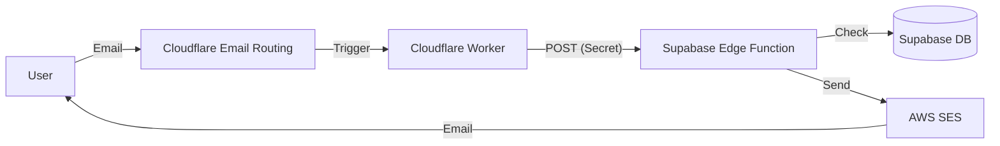

# Automated Downloads System Guide

This document outlines the system for automatically sending download links via email responses. The system is designed to handle users who request the software download via email (specifically for "email-only" users like NetFree/Rimon).

## Architecture

The system uses a 3-tier architecture:

1.  **Ingress (Cloudflare)**: Receives the email, filters spam, and triggers the logic.
2.  **Logic (Supabase)**: Handles rate limiting, logging, and decision making.
3.  **Delivery (AWS SES)**: Sends the actual email with the download link.



## Components

### 1. Database (Supabase)

New tables and functions were added via migration `20250101120000_automated_downloads.sql`:

- `download_requests`: Logs every attempt (status: sent, blocked, error).
- `download_rate_limits`: Tracks daily usage per email address.
- `increment_download_count`: RPC function for atomic rate limiting.

### 2. Edge Function (`process-email-request`)

Located in `supabase/functions/process-email-request/index.ts`.

- Validates `CLOUDFLARE_WORKER_SECRET`.
- Enforces rate limit (default: 3/day).
- Sends email using `SimpleEmailService` (via SES).
- Logs outcome to DB.

**Required Secrets:**

- `CLOUDFLARE_WORKER_SECRET`: Shared secret for authentication.
- `JUMBOMAIL_LINK`: The actual download link.
- `SES_FROM_MAASER`: Sender email (default: `maaser@ten10-app.com`).
- Standard AWS credentials (`AWS_ACCESS_KEY_ID`, `AWS_SECRET_ACCESS_KEY`, `AWS_REGION`).

### 3. Cloudflare Worker (`ten10-email-router`)

Script located in `infrastructure/cloudflare/email-worker.js`.

- Filters large emails (>256KB) and auto-responses.
- Forwards valid requests to the Supabase Edge Function.

**Required Variables (Cloudflare):**

- `SUPABASE_FUNCTION_URL`: Full URL to the edge function.
- `CLOUDFLARE_WORKER_SECRET`: Must match the Supabase secret `CLOUDFLARE_WORKER_SECRET`.

## Deployment Guide

### Step 1: Database Migration

The DB objects were created in Supabase (tables + RPC). If you need to recreate them, run the SQL from your migration history in the Supabase SQL Editor:

- `download_requests`
- `download_rate_limits`
- `increment_download_count(p_email text) -> int`

### Step 2: Supabase Secrets

Set the following secrets in your Supabase project:

```bash
supabase secrets set CLOUDFLARE_WORKER_SECRET="your-secure-random-string"
supabase secrets set JUMBOMAIL_LINK="https://www.jumbomail.me/..."
supabase secrets set SES_FROM_MAASER="maaser@ten10-app.com"
```

### Step 3: Deploy Edge Function

```bash
supabase functions deploy process-email-request --no-verify-jwt
```

**Important:** `--no-verify-jwt` is required because Cloudflare authenticates with a shared secret (`CLOUDFLARE_WORKER_SECRET`) and not a Supabase JWT.

### Step 4: Cloudflare Setup

1.  **Create Worker**: Create a new worker named `ten10-email-router`.
2.  **Code**: Copy content from `infrastructure/cloudflare/email-worker.js`.
3.  **Variables**: In Worker Settings > Variables, add `SUPABASE_FUNCTION_URL` and `CLOUDFLARE_WORKER_SECRET`.
4.  **Email Routing**:
    - Go to Email Routing > Routes.
    - Create a Custom Address (e.g., `maaser@ten10-app.com`).
    - Action: "Send to a Worker" -> Select `ten10-email-router`.

### Optional: Git-based deployments (Cloudflare Builds)

If you connect the Worker to GitHub for auto-deploys, set:

- **Root directory**: `infrastructure/cloudflare`
- Ensure `wrangler.toml` exists in that directory.

## Testing

1.  Send an email to `maaser@ten10-app.com`.
2.  Check Cloudflare Worker logs for "Success".
3.  Check Supabase `download_requests` table for a new record.
4.  Verify receipt of the auto-reply email.
5.  Send 3 more emails to verify rate limiting (4th should be blocked).

## Incident Log / Known Failure Mode

### 2026-01-01: Gmail bounce `555 5.7.1 Temporary System Error`

**Symptom**

- Sender receives: `555 5.7.1 Temporary System Error`
- Gmail UI: "The message was not delivered" to `maaser@ten10-app.com`.

**Root cause**

- Cloudflare Worker called the Supabase Edge Function and got:
  - `401 {"code":401,"message":"Invalid JWT"}`
- This happens when **Supabase Edge Function JWT verification is enabled** for `process-email-request`.
- Cloudflare authenticates with a shared secret header (`Authorization: Bearer <CLOUDFLARE_WORKER_SECRET>`), which is **not a Supabase JWT**.

**Fix**

- Disable JWT verification for the edge function:

  - CLI: `supabase functions deploy process-email-request --no-verify-jwt`
  - Or in Supabase Dashboard: Edge Functions → `process-email-request` → Settings → **Verify JWT: Off**
  - Recommended (repo): enforce via `supabase/config.toml`:
    ```toml
    [functions.process-email-request]
    verify_jwt = false
    ```

- Rate limiting UX:
  - The edge function returns HTTP `429` when rate-limited.
  - The Cloudflare Worker should reject the email with a clear message, so the sender gets immediate feedback.

**How to confirm**

- In Cloudflare Worker logs, you should see:
  - `Success: Processed email from ...`
- You should no longer see:
  - `Supabase error: 401 ... Invalid JWT`

**Prevent recurrence**

- Always deploy `process-email-request` with `--no-verify-jwt`.
- Prefer enforcing this once in `supabase/config.toml` so future deploys don't accidentally re-enable JWT verification.
- If the route breaks again, check Cloudflare logs first: they will show the exact Supabase status and body.
